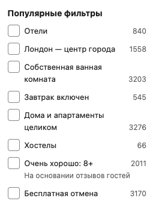

Angelfish glided past sea fans, their elegant fins trailing like silk ribbons in the gentle current. A curious parrotfish scraped at the coral with its beak-like mouth, creating small clouds of sediment that drifted lazily away. In the distance, a pod of dolphins breached the surface, their sleek bodies arcing through the air before splashing back into the azure depths.

Angelfish glided past sea fans, their elegant fins trailing like silk ribbons in the gentle current. A curious parrotfish scraped at the co

More info