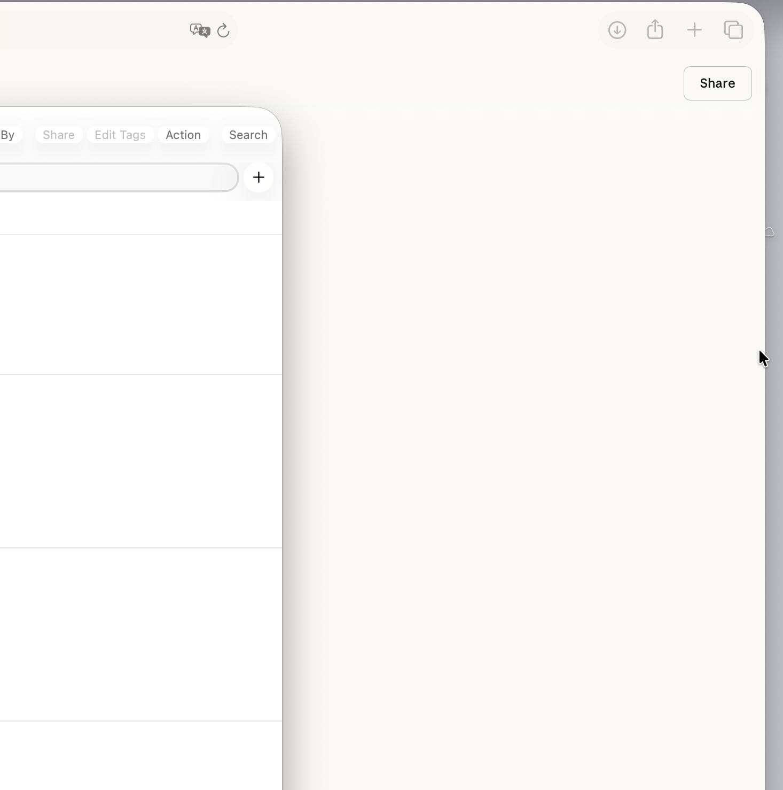

Test Doc Page 1 content 

Go to another page [Edited page](/docs/overview/testdoc/edited-page/) 

 


<div class="table-container">
<table ac:local-id="c59884a0-05d1-42b8-aa03-bb17e3bc96e1" data-layout="default" data-table-width="760"><tbody><tr><th><strong>Table T 1</strong></th><th><strong>Table T 2</strong></th><th><strong>Table T 3</strong></th></tr><tr><td>List I<br/>List I 2<br/>list I 3<br/>ku</td><td><em>test data</em><br/><strong>test data</strong></td><td><strong>test data</strong></td></tr><tr><td>(test data)</td><td>‘test data’</td><td>-test data-</td></tr></tbody></table>
</div>


1. One
2. Two
3. Three


```
code
code
code
```


> [!IMPORTANT]
> Info pannel


{}

Expand Info


1. The reef teemed with life - clownfish nestled among anemone tentacles, moray eels peeked from crevices, and a sea turtle paddled overhead, casting a shadow across the sandy bottom.
2. As evening approached, nocturnal species began to emerge: lionfish with their venomous spines, octopi changing colors, and bioluminescent plankton that would soon transform the water into a galaxy of tiny stars.

{}
